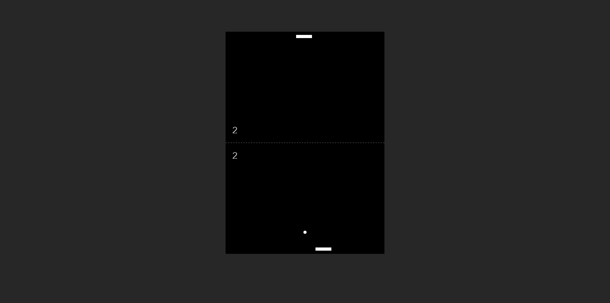

# Pong

The Pong project is a modern recreation of the classic arcade game, providing an engaging and competitive experience. Built using HTML5 Canvas, CSS, and JavaScript, it features smooth animations, responsive controls, and an intuitive interface.

This project was developed as part of the course "JavaScript Web Projects: 20 Projects to Build Your Portfolio" by Zero To Mastery.

## Table of contents

- [Pong](#pong)
  - [Table of contents](#table-of-contents)
  - [Overview](#overview)
    - [Screenshot](#screenshot)
    - [Links](#links)
    - [Built with](#built-with)
    - [What I learned](#what-i-learned)
    - [Useful resources](#useful-resources)
  - [Author](#author)
  - [Acknowledgments](#acknowledgments)

## Overview

The Pong project is an interactive browser-based game that captures the essence of the original arcade classic. Players can:
- Compete against a computer-controlled opponent with increasing difficulty.
- Control the paddle using smooth mouse movements.
- Enjoy a responsive gameplay experience optimized for desktop and mobile devices.

### Screenshot



### Links

- Live Site URL: [DT Code](https://pong.dtcode.se/)

### Built with

- HTML5:
  - Canvas API for rendering the game elements and animations.
  - Semantic structure for a clear and maintainable layout.
- CSS3:
  - Custom styling for game elements, including paddles, ball, and scoreboard.
  - Responsive design to adapt to different screen sizes.
- JavaScript (ES6+):
  - Game logic, including ball physics, paddle movements, and collision detection.
  - AI for computer-controlled paddle movement.
  - Event-driven mechanics for player interaction.

### What I learned

This project helped me deepen my knowledge of:
- Canvas API:
  - Rendering dynamic shapes and animations directly on the canvas.
  - Managing frame-by-frame updates for smooth gameplay.
- Game Mechanics:
  - Implementing collision detection between game elements.
  - Adjusting ball trajectory based on paddle interaction.
- Responsive Design:
  - Adapting gameplay experience for mobile and desktop users.
- Event Handling:
  - Capturing and processing real-time user input for paddle movement.

The following code snippet demonstrates how the ball's movement and collisions are handled in the game:

```js
function ballBoundaries() {
  // Bounce off Left Wall
  if (ballX < 0 && speedX < 0) {
    speedX = -speedX;
  }
  // Bounce off Right Wall
  if (ballX > width && speedX > 0) {
    speedX = -speedX;
  }
  // Bounce off player paddle (bottom)
  if (ballY > height - paddleDiff) {
    if (ballX > paddleBottomX && ballX < paddleBottomX + paddleWidth) {
      paddleContact = true;
      speedY = -speedY;
      trajectoryX = ballX - (paddleBottomX + paddleDiff);
      speedX = trajectoryX * 0.3;
    } else if (ballY > height) {
      ballReset();
      computerScore++;
    }
  }
  // Bounce off computer paddle (top)
  if (ballY < paddleDiff) {
    if (ballX > paddleTopX && ballX < paddleTopX + paddleWidth) {
      speedY = -speedY;
    } else if (ballY < 0) {
      ballReset();
      playerScore++;
    }
  }
}
```

### Useful resources

- [MDN Web Docs: Canvas API](https://developer.mozilla.org/en-US/docs/Web/API/Canvas_API) - Helped with understanding rendering techniques on canvas.
- [MDN Web Docs: Collision Detection](https://developer.mozilla.org/en-US/docs/Games/Techniques/2D_collision_detection) - A great guide on detecting collisions between objects in 2D games.

## Author

- GitHub - [@dantvi](https://github.com/dantvi)
- LinkedIn - [@danieltving](https://www.linkedin.com/in/danieltving/)

## Acknowledgments

Special thanks to Zero To Mastery for their structured course content and to MDN Web Docs for their invaluable resources on game development.
